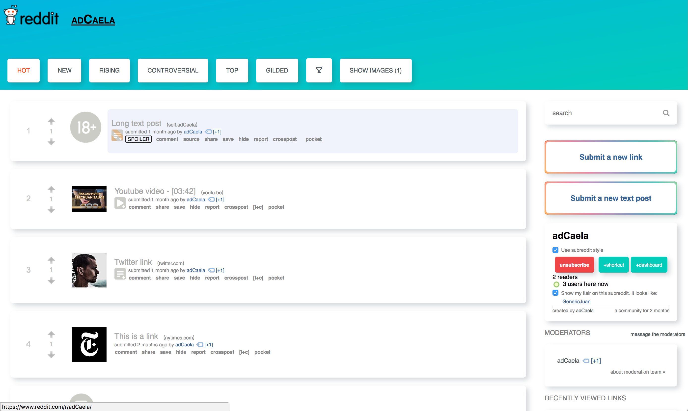

# Subreddit CSS concepts

**This is currently a work in progress**.

I, like many others, find reddit's default css styles rather visually unappealing. I decided to create my own in Sass,
and you can check out its current status at [r/adCaela](https://reddit.com/r/adCaela).

This concept has been inspired by both the new App Store in iOS11, and Udacity's current websites.

## TODO

* Fix broken default link icons. See #1 for more details.
* Fix main header for both text only and image headers.
* Fix submit new link/text page. See #3 for more details.
* Fix subscribe button on the sidebar. See #4 for more details.

## Preview of current state

